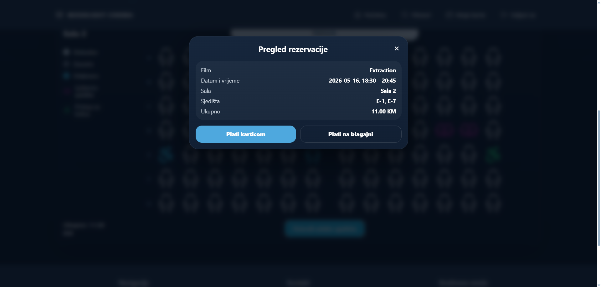
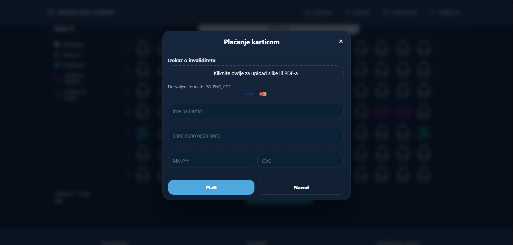
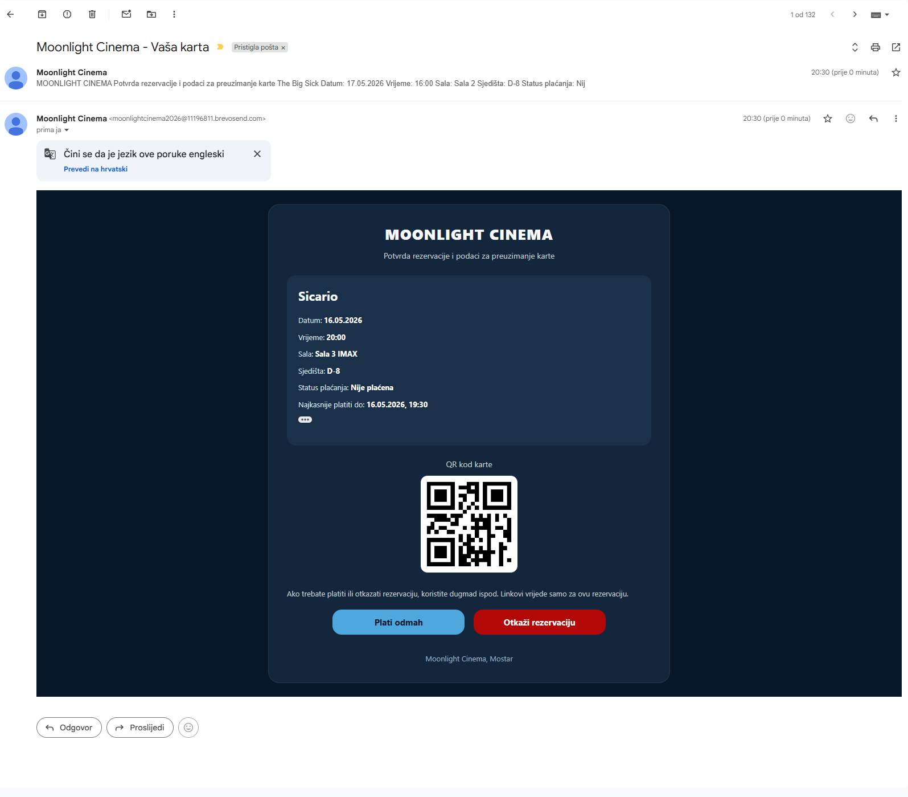

# Moonlight Cinema

Moonlight Cinema is a cinema reservation web application built as a portfolio project for demonstrating full-stack web development, database integration, responsive UI, reservation workflows, email ticket delivery, and cloud deployment.

The application allows users to browse movies, view movie details, select available screening times, choose seats, create reservations, receive an email ticket with a QR code, view their tickets, and cancel reservations. The project also includes an admin side for managing cinema data such as movies, screenings, halls, seats, reservations, and pricing.

## Live Demo

[Open live demo](https://moonlight-cinema.freedev.app)

> Note: This is a demo/portfolio application. It does not use real payment processing.

## Demo Credentials

### Admin Account

```text
Email: admin@moonlightcinema.ba
Password: Admin123!
```

### User Account

```text
Email: sulejman@moonlightcinema.ba
Password: Moonlight123!
```

## Team

This project was developed by:

- **Sulejman Zekotic** – backend development, database integration, reservation logic, deployment, project configuration, documentation
- **Amina Ahmić** – frontend UI, responsive design, testing, screenshots, documentation, feature planning

## Features

### User Features

- Browse available movies
- View movie details
- View available screening times
- Select seats through an interactive seat picker
- Create a reservation
- Receive an email ticket with a QR code
- View existing tickets
- Cancel reservations
- Responsive design for desktop and mobile devices

### Admin Features

- Manage movies
- Manage screenings
- Manage halls and seats
- View and manage reservations
- Configure pricing
- Control cinema-related data through the admin interface

## Tech Stack

- PHP
- JavaScript
- HTML
- CSS
- SQLite / MySQL
- Composer
- InfinityFree (PHP + MySQL hosting)
- Brevo SMTP (email tickets)
- GitHub

## Screenshots

### Home Page


### Movie Details


### Seat Selection


### Reservation Modal - First Step



### Reservation Modal - Second Step



### Ticket Email



### Mobile Tickets


## Project Structure

```text
moonlight-cinema-app/
├── .github/
├── app/
│   ├── config.php
│   ├── bootstrap.php
│   ├── Database.php
│   ├── Auth.php
│   ├── Mailer.php
│   ├── CinemaRepository.php
│   └── helpers.php
├── assets/
│   ├── css/
│   ├── js/
│   └── images/
├── screenshots/
├── storage/
├── vendor/
├── .gitignore
├── .htaccess
├── README.md
├── README_AZURE_DEPLOY.md
├── index.php
└── web.config
```

## How to Run Locally

### Prerequisites

Before running the project locally, make sure you have installed:

- PHP
- Composer
- Git
- SQLite or MySQL

### 1. Clone the Repository

```bash
git clone https://github.com/Sulejman-Zekotic/moonlight-cinema-app.git
cd moonlight-cinema-app
```

### 2. Install Dependencies

```bash
composer install
```

### 3. Configure the Database

The application can be configured to use SQLite or MySQL.

For local development, SQLite is the easiest option.

Create a local SQLite database file inside the `storage` folder, for example:

```text
storage/database.sqlite
```

Example SQLite configuration:

```text
MC_DB_DRIVER=sqlite
MC_DB_SQLITE_PATH=storage/database.sqlite
```

For MySQL, configure these values instead:

```text
MC_DB_DRIVER=mysql
MC_DB_HOST=localhost
MC_DB_PORT=3306
MC_DB_NAME=moonlight_cinema
MC_DB_USER=root
MC_DB_PASS=your_password
```

> Database credentials and production secrets should be stored as environment variables and should not be committed to the repository.

### 4. Configure Mail Settings

Email ticket delivery requires SMTP configuration.

Example mail configuration:

```text
MC_MAIL_FROM=your-email@example.com
MC_MAIL_FROM_NAME=Moonlight Cinema
MC_MAIL_REPLY_TO=your-email@example.com
MC_MAIL_TRANSPORT=smtp
MC_SMTP_HOST=smtp.example.com
MC_SMTP_PORT=587
MC_SMTP_USER=your_smtp_username
MC_SMTP_PASS=your_smtp_password
MC_SMTP_SECURE=tls
```

For local testing, email sending can be configured with a test SMTP provider such as Mailtrap.

### 5. Run the Application

Start the local PHP development server:

```bash
php -S localhost:8000
```

Open the app in your browser:

```text
http://localhost:8000
```

### 6. Admin Access

If the application does not already contain an admin user, an admin account should be created through the project setup logic or directly in the local development database.

Admin credentials should not be committed to the repository.

## Deployment

The live demo runs on free hosting:

- **Hosting:** InfinityFree (Apache + PHP 8)
- **Database:** MySQL (schema and demo data are created automatically by `app/Installer.php`)
- **Email:** Brevo SMTP relay for reservation tickets and password reset links

The project was originally deployed on Azure App Service and later moved to free hosting.
During the migration from SQLite to MySQL, a compatibility bug was found and fixed:
SQLite uses `||` for string concatenation, while MySQL treats `||` as logical OR,
so screening date/time comparisons always failed. The repository now builds these
expressions per database driver (`CONCAT()` on MySQL).

### Configuration

Server settings are read from environment variables or, on shared hosting without
environment variables, from `app/config.local.php`:

1. Copy `app/config.local.php.example` to `app/config.local.php`
2. Fill in database and SMTP credentials
3. `app/config.local.php` is listed in `.gitignore` and must never be committed

Direct browser access to `app/` and `storage/` is blocked with `.htaccess`.

## Documentation

- `app/config.local.php.example` - configuration template for shared hosting
- `screenshots/` - Application screenshots used in the README

## Security Notes

Sensitive configuration values such as database credentials, SMTP passwords, API keys, and environment variables should not be committed to the repository.

The repository should not include:

- `.env` files
- Real database files with user data
- SMTP credentials
- API keys
- Production secrets
- Private logs

## Project Status

This project is completed as a portfolio/internship project.

It demonstrates:

- Full-stack web application development
- PHP backend structure
- Database-driven reservation system
- Interactive frontend functionality
- Responsive UI design
- Email ticket workflow
- QR ticket concept
- Admin management features
- Azure cloud deployment
- Git and GitHub project organization

## Authors

- Sulejman Zekotic
- Amina Ahmić

## License

This project is available for portfolio and educational purposes.
