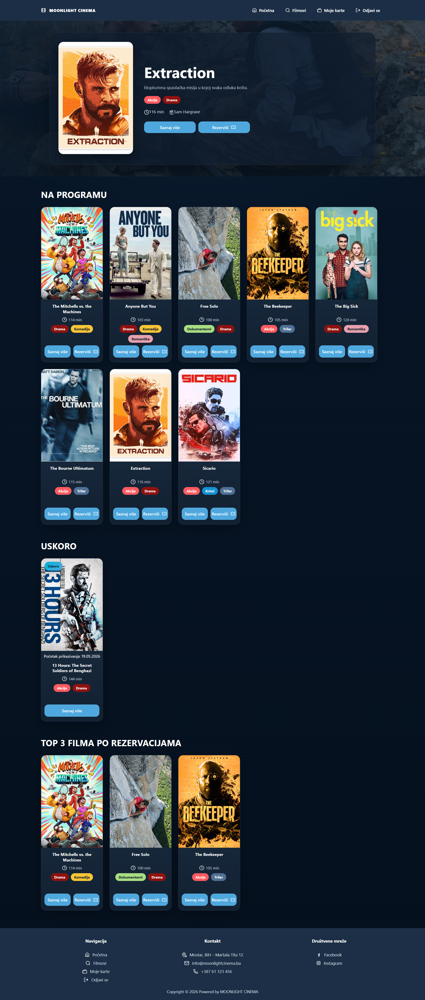
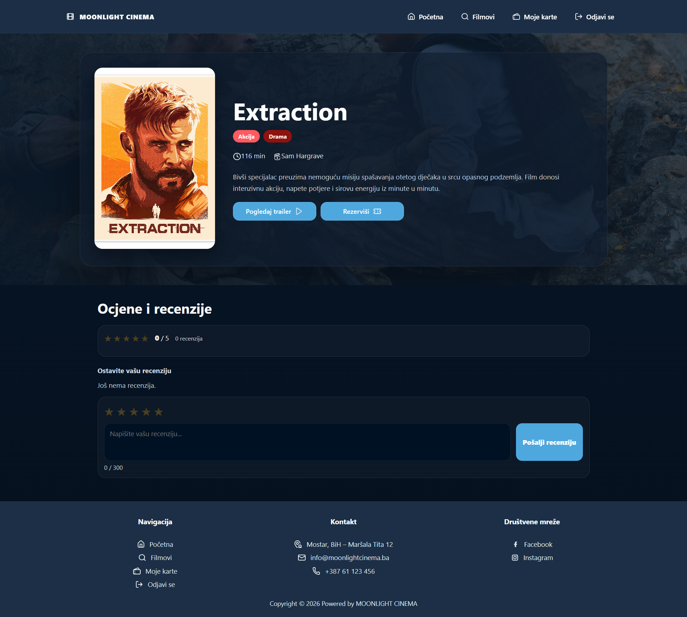
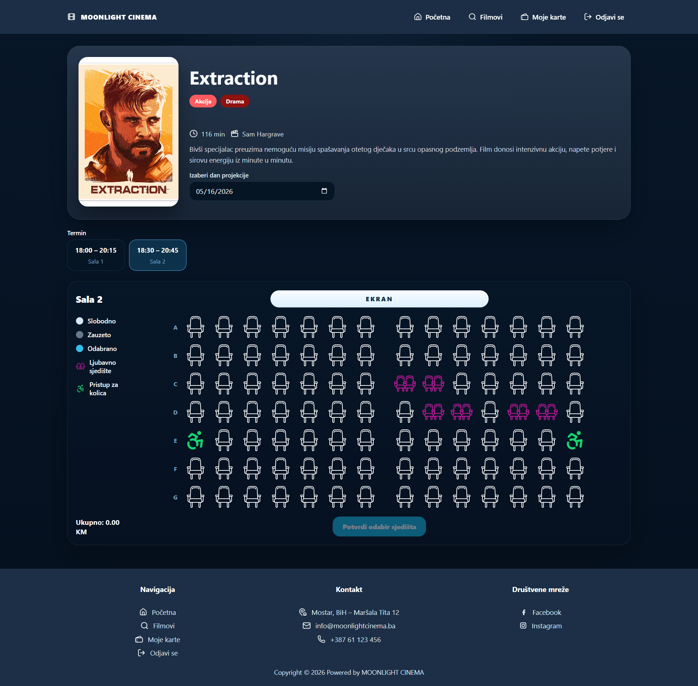
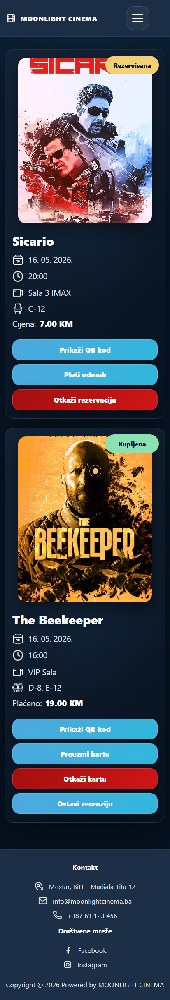

# Moonlight Cinema

Moonlight Cinema is a cinema reservation web application built as a portfolio project for demonstrating full-stack web development, database integration, responsive UI, reservation workflows, email ticket delivery, and cloud deployment.

The application allows users to browse movies, view movie details, select available screening times, choose seats, create reservations, receive an email ticket with a QR code, view their tickets, and cancel reservations. The project also includes an admin side for managing cinema data such as movies, screenings, halls, seats, reservations, and pricing.

## Live Demo

[Open live demo](https://moonlightcinema-afgwhdb4ffhpcsh7.northeurope-01.azurewebsites.net)

> Note: This is a demo/portfolio application. It does not use real payment processing.

## Team

This project was developed by:

- **Sulejman Zekotic** – backend development, database integration, reservation logic, Azure deployment, project configuration, documentation
- **Amina Ahmić** – frontend UI, responsive design, testing, screenshots, documentation, feature planning

## Features

### User Features

- Browse available movies
- View movie details
- View available screening times
- Select seats through an interactive seat picker
- Create a reservation
- Receive an email ticket with a QR code
- View existing tickets
- Cancel reservations
- Responsive design for desktop and mobile devices

### Admin Features

- Manage movies
- Manage screenings
- Manage halls and seats
- View and manage reservations
- Configure pricing
- Control cinema-related data through the admin interface

## Tech Stack

- PHP
- JavaScript
- HTML
- CSS
- SQLite / MySQL
- Composer
- Azure App Service
- GitHub

## Screenshots

### Home Page



### Movie Details



### Seat Selection



### Reservation Modal - First Step


### Reservation Modal - Second Step


### Ticket Email


### Mobile Tickets



## Project Structure

```text
moonlight-cinema-app/
├── .github/
├── app/
│   ├── config.php
│   ├── bootstrap.php
│   ├── Database.php
│   ├── Auth.php
│   ├── Mailer.php
│   ├── CinemaRepository.php
│   └── helpers.php
├── assets/
│   ├── css/
│   ├── js/
│   └── images/
├── docs/
│   └── screenshots/
├── storage/
├── vendor/
├── .gitignore
├── .htaccess
├── README.md
├── README_AZURE_DEPLOY.md
├── index.php
└── web.config
